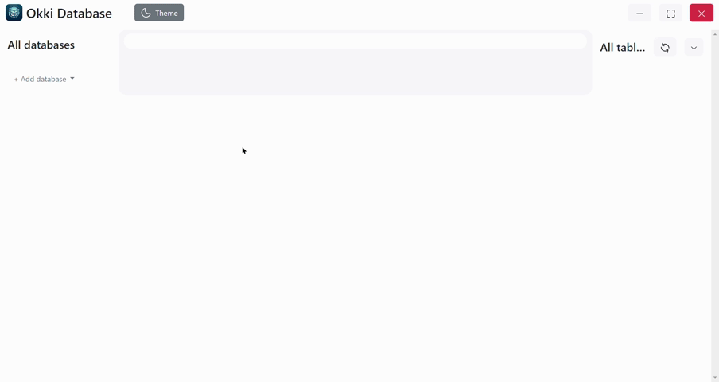

# 🗄 Okki Database

**Okki Database** is a standalone desktop application designed for **viewing SQL databases** with a clean and intuitive interface.  
It supports both **SQLite** and **MySQL** formats, making it a handy tool for developers, analysts, and database explorers.

Built using [Electron.js](https://www.electronjs.org/), it provides the convenience of a desktop tool with the flexibility of modern web technologies.

## 🚀 Quick Start

Make sure you have <a href="https://nodejs.org/">Node.js</a> installed on your system.

### 📦 Install dependencies:  
<code>npm install</code>

### ▶ Run in development mode:  
<code>npm run start</code>

### 🛠 Build the installer:  
<code>npm run build</code>

The output will be located inside the <code>dist/</code> folder.

## 📥 Download Installer

👉 <strong>[Download .exe (Windows)](https://disk.yandex.kz/d/-8kMy-YqPyxX9g)</strong>  

## 🧠 Features

- View SQL tables quickly without writing queries  
- Support for both <strong>SQLite</strong> and <strong>MySQL</strong>  
- Table navigation, row viewing, pagination  
- Clean UI with light/dark mode compatibility  
- Fast standalone performance, no setup needed  
- Ideal for reading and inspecting database files or server connections

## 📄 License

Licensed under the <strong>MIT</strong> license — feel free to use and modify.

> Developer: <strong>Temirkhan</strong>  
> <a href="https://www.instagram.com/temirkhanrustemov/">@temirkhanrustemov</a> • <code>temirkhan.onyx@gmail.com</code>
